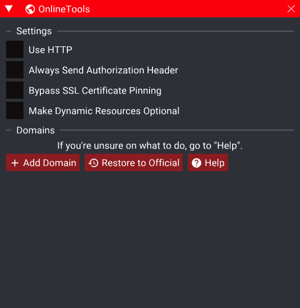
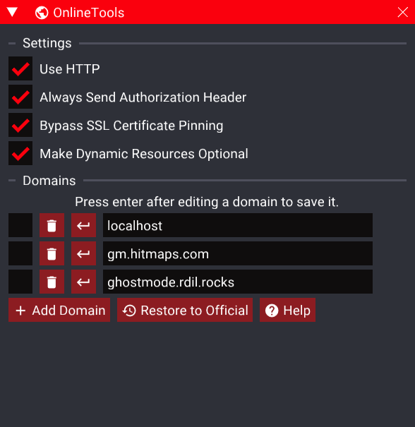
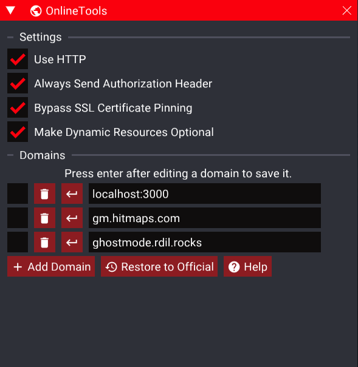
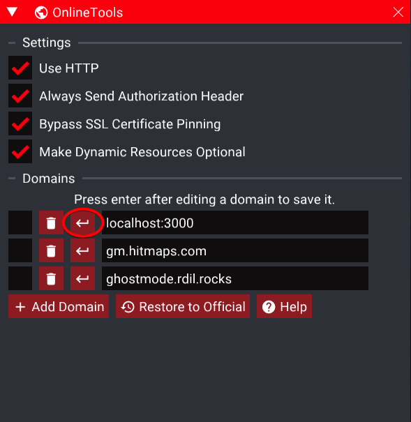
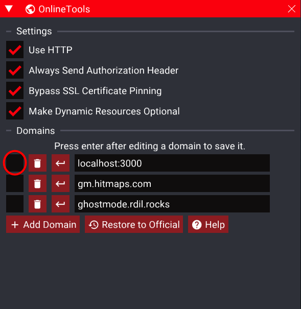

# ⚠️ Important note
While the Peacock server officially support Linux, the patcher does not officially support Linux/Proton.
This guide is provided as is, it may not work with everyone's Linux setup and may require extra changes to make it work for you.

Because we're not Linux experts, we cannot guarantee to be able to help you fix your issues. You may check [our Discord](https://thepeacockproject.org/discord) in the Linux megathread help channel.
We're also open to pull requests and tips on how to improve this guide!

# Setup

Instructions:
## Ensure you have the dependencies
  - `curl`
  - `unzip`

## Clone this git repository

```
git clone https://github.com/thepeacockproject/linux-steam-setup
```

Downloading the zip works too, if you don't have git installed. 

By default, the service expects the folder to live in `$HOME/linux-steam-setup` but it can go wherever you want, just make sure to edit the `peacock.service` file.

**Any changes made to the service file must be followed up with a `systemctl --user daemon-reload` in order to load the new service definition**

## Copy `peacock.service` to `.config/systemd/user`

```bash
mkdir -p ~/.config/systemd/user
cp peacock.service ~/.config/systemd/user/
```

If you want to set it to run on startup & also run now with `systemctl --user enable --now peacock`
If you'd rather just run it as and when you wanted, `systemctl --user start peacock` and `systemctl --user stop peacock`

Non-systemd users should use whichever init system they use to call the start.sh script on startup.

## Verify a clean startup

Running `systemctl --user status peacock`

You should see something like

```
● peacock.service - Peacock
     Loaded: loaded (/home/deck/.config/systemd/user/peacock.service; enabled; preset: enabled)
     Active: active (running) since Wed 2023-12-20 16:40:06 GMT; 2h 25min ago
   Main PID: 79790 (start.sh)
      Tasks: 12 (limit: 14125)
     Memory: 42.3M
        CPU: 1.612s
     CGroup: /user.slice/user-1000.slice/user@1000.service/app.slice/peacock.service
             ├─79790 /bin/bash /home/deck/build/linux-steam-setup/start.sh
             └─79804 ./node/bin/node ./Peacock/chunk0.js

Dec 20 16:40:07 steamdeck start.sh[79804]:  ░██████████  ░██████    ░███████████ ░███         ░███      ░███░███          ░███████
Dec 20 16:40:07 steamdeck start.sh[79804]:  ░███░░░░░░   ░███░░█    ░███░░░░░███ ░███         ░███      ░███░███          ░███░░███
Dec 20 16:40:07 steamdeck start.sh[79804]:  ░███         ░███ ░   █ ░███    ░███ ░░███     ███░░███     ███ ░░███     ███ ░███ ░░███
Dec 20 16:40:07 steamdeck start.sh[79804]:  █████        ██████████ █████   █████ ░░█████████  ░░░███████░   ░░█████████  █████ ░░████
Dec 20 16:40:07 steamdeck start.sh[79804]: ░░░░░        ░░░░░░░░░░ ░░░░░   ░░░░░   ░░░░░░░░░     ░░░░░░░      ░░░░░░░░░  ░░░░░   ░░░░
Dec 20 16:40:07 steamdeck start.sh[79804]: [16:40:07:100] [Info] This is Peacock v6.5.6 (rev 6560), with Node v18.15.0.
Dec 20 16:40:07 steamdeck start.sh[79804]: [16:40:07:102] [Info] Booting Peacock internal services - this may take a moment.
Dec 20 16:40:07 steamdeck start.sh[79804]: [16:40:07:104] [Info] Server started.
Dec 20 16:40:07 steamdeck start.sh[79804]: [16:40:07:271] [Debug] Discovered 161 escalation groups.
Dec 20 16:40:07 steamdeck start.sh[79804]: [16:40:07:591] [Debug] Peacock is up to date.
```

The most important bit there is "Server started" and "Peacock is up to date". If Peacock is not up to date, remove the Peacock folder and restart the service with `systemctl --user restart peacock`

## Connecting to Peacock

There are now two methods you can use to connect to Peacock, you can;
- Use the OnlineTools SDK mod (recommended), or;
- Launch the Patcher in the same Wine prefix.

The OnlineTools SDK mod allows you to set a different server as the default one, so when you start the game up you don't have to do anything to connect to Peacock (assuming the server starts on startup).

If you'd prefer to use the Patcher, instructions can be found in the spoiler below;

<details>
  <summary>Legacy Patcher Instructions</summary>

  ## Adjust your launch options in Steam
  
  Ensure this is copied exactly, you can use the clipboard icon next to this snippet to copy it (assuming you're browsing this on github.com)
  
  ```bash
  bash -c 'exec "${@/Launcher.exe/WineLaunch.bat}"' -- %command%
  ```
  
  Then right-click on the game in Steam -> Properties and paste it in the "Launch Options" box. Steam Deck users should use the cog icon on the game detail view then continue as needed; but due to the awkward keyboard you might find it easier to do in desktop mode.
  
  ## Start Hitman 3
  Run from anywhere, the game should start alongside the Peacock Patcher. If your game starts up full-screen, then you will have to alt-tab out.
  
  Steam Deck users can access the patcher by pressing the Steam button and navigating to the active windows at the bottom of the "HITMAN 3" section.
  
  ## Edit Peacock Patcher Server address to `127.0.0.1:3000`
  
  It's not clear that you can directly edit the combo box that says "Peacock Local" but you can, type `127.0.0.1:3000` in the combo box then click Re-patch. The Patcher will save this setting and you won't be required to edit it again.
  
  It's important to change this as the default "Peacock Local" expects it to live on port 80.
  
  If you have issues on the login screen, check if you have the following entry in your `/etc/hosts` file:
  
  ```
  127.0.0.1    localhost
  ```
  
  While it's not recommended, you can modify `start.sh` and remove the `PORT=3000` to default back to loading Peacock on port 80 and run Peacock **as root**.
  
  **Game is ready to play with Peacock!**
</details>

## Installing the SDK

You can install the [ZHMModSDK](https://`github.com/OrfeasZ/ZHMModSDK/releases/latest) on Linux by following [this guide](https://github.com/OrfeasZ/ZHMModSDK/blob/master/INSTALL-deck.md), if you're on Epic (and using Heroic Games Launcher) you can open Winecfg directly through the settings menu of HITMAN 3 (World of Assassination).

OnlineTools is included in the standard SDK release so you do not need to download anything else.

## Configuring OnlineTools

Start the game and open the SDK panel with the `~` key (`^` on QWERTZ layouts), click the `Mods` button in the top left, find `OnlineTools` and check the box next to it, finally press `OK`.

Next, open the SDK panel again. There should be a new `OnlineTools` button on the bar at the top of the screen, click this button and the following menu should appear;



Then, press the `Help` button, give the menu that pops up a read to familiarise yourself with the mod. Then press `Load Old Patcher Settings` and close the help popup.

The main OnlineTools window should now look like this;



If you have not changed the port from the default of `3000`, you need to change the `localhost` line to `localhost:3000` then press enter.

If you are using port `80` you do not need to change this. If you changed it to something other than `3000`, you need to change it to `localhost:PORT` where `PORT` is your chosen port.

The window should now look like this (if you are using the default configuration);



If you want to choose when you connect to Peacock, you can open the OnlineTools menu and press the circled button below;



If you want to connect to Peacock every time you start the game, you can check the box highlighted below;



# Troubleshooting

To allow Peacock to work seamlessly in a regular Linux desktop & the gaming mode on the Steam Deck; this script installs a SystemD service to enable this to be run at boot regardless of setup.

Some simple commands are included in setup, and for the most part the script should show errors in `systemctl --user status peacock` or `journalctl -xb --user -u peacock` and check any errors you get with the below list. If your issue isn't listed here, file an issue or post in the [megathread](https://discord.com/channels/826809653181808651/1026456932007034910) on the Peacock Discord.

## Error: Cannot find module '/home/deck/build/linux-steam-setup/Peacock/chunk0.js'
These setup instructions wrap around the existing code from Peacock, and to simplify setup we attempt to pull this automatically. If you see this error, this likely means there was an issue pulling this down. This should be reported to us so we can correct the URL if needed; but this could also just be a network issue on your end. Verify other websites work before filing such an issue.

## ./node/bin/node: No such file or directory
This indicates there was some issue downloading NodeJS. This can be fixed yourself by either installing node yourself through your package manager of choice or by downloading the zip and moving it to where `start.sh` lives and rename the folder to `node` (such that `node/bin/node` should return), but this may also indicate something worth filing an issue for.

## [Error] Failed to use the server on 0.0.0.0:3000!
As the subsequent lines suggest, this error means that Peacock is already running somewhere else. `pkill node` should kill everything, but you should first verify with `ps aux | grep node` that the only thing you'll kill is the Peacock process (you should have output similar to the below)

```
deck       71017  1.5  1.1 1000684 138488 pts/5  Sl+  11:20   0:01 node ./Peacock/chunk0.js
deck       71116  0.0  0.0  52616  2416 pts/6    S+   11:21   0:00 grep --color=auto node
```
