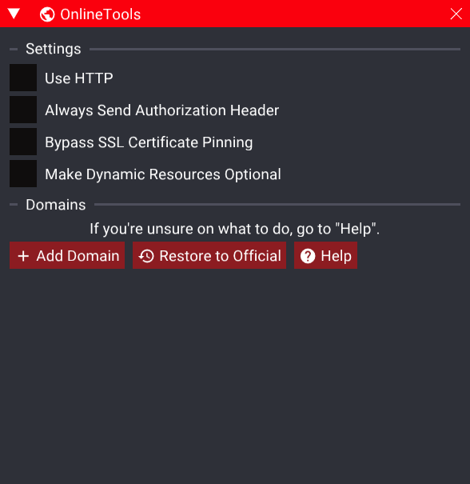
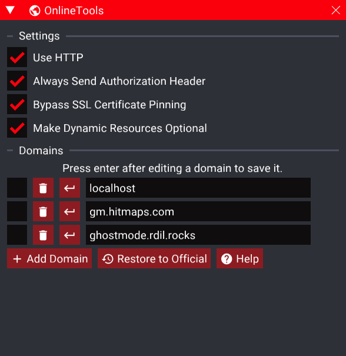
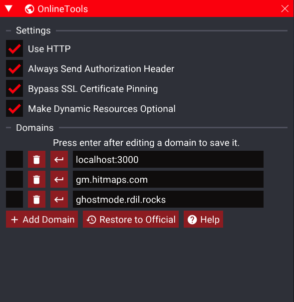
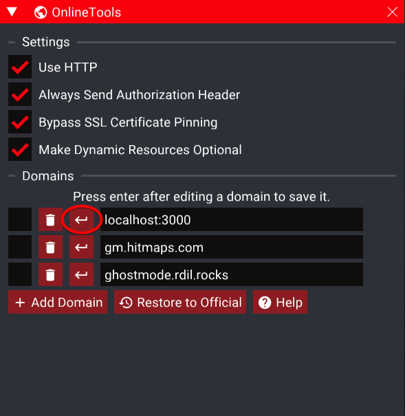
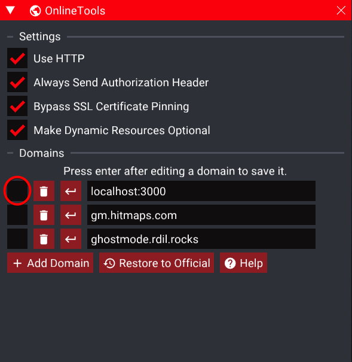

# Peacock Linux Launcher

A TUI (Terminal User Interface) application for managing [Peacock](https://thepeacockproject.org/) on Linux. Distributed as a single AppImage — download, run, and you're set.

> **Note:** While the Peacock server officially supports Linux, the overall Linux/Proton setup is community-maintained. Join [our Discord](https://thepeacockproject.org/discord) for help.

## Features

- **Install & Update Peacock** — downloads the latest release, preserves your `userdata/` across updates
- **Install & Update Node.js** — automatically matches the version Peacock requires
- **Systemd Service Management** — install, start/stop, enable on boot, remove — all from the TUI
- **ZHMModSDK Management** — download and install for each detected Hitman 3 install
- **Steam + Heroic Detection** — automatically finds Hitman 3 game directories and Wine prefixes (including Flatpak paths)
- **Migration Wizard** — migrate an existing `linux-steam-setup` shell-script or manual Peacock install to the new location
- **Settings** — configurable install directory and Peacock server port
- **Keyboard-driven UI** — fully navigable with arrow keys, Enter, and Escape (Steam Deck compatible)

## Quick Start

1. **Download** the latest `peacock-launcher-*-x86_64.AppImage` from [Releases](https://github.com/thepeacockproject/linux-steam-setup/releases)
2. **Make it executable:**
   ```bash
   chmod +x peacock-launcher-*.AppImage
   ```
3. **Run it:**
   ```bash
   ./peacock-launcher-*.AppImage # Or double-click the file in your file manager
   ```
4. Select **Install / Update Peacock & Node** from the main menu
5. Select **Manage Service** → **Install Service** → **Start Service** to have Peacock running in the background
6. (Optional) Select **Enable on Boot** to have Peacock start automatically when you log in
7. (Optional) Select **Manage ZHMModSDK** to install the SDK into your Hitman 3 directory

## Navigation

| Key | Action |
|-----|--------|
| `↑` `↓` | Move between menu items |
| `Enter` | Select / confirm |
| `Esc` | Go back |

## Connecting to Peacock

Start the game and open the SDK panel with the `~` key (`^` on QWERTZ layouts or `²` on AZERTY layouts), click the `Mods` button in the top left, find `OnlineTools` and check the box next to it, finally press `OK`.

Next, open the SDK panel again. There should be a new `OnlineTools` button on the bar at the top of the screen, click this button and the following menu should appear;



Then, press the `Help` button, give the menu that pops up a read to familiarise yourself with the mod. Then press `Load Old Patcher Settings` and close the help popup.

The main OnlineTools window should now look like this;



If you have not changed the port from the default of `3000`, you need to change the `localhost` line to `localhost:3000` then press enter.

If you are using port `80` you do not need to change this. If you changed it to something other than `3000`, you need to change it to `localhost:PORT` where `PORT` is your chosen port.

The window should now look like this (if you are using the default configuration);



If you want to choose when you connect to Peacock, you can open the OnlineTools menu and press the circled button below;



If you want to connect to Peacock every time you start the game, you can check the box highlighted below;



See the [ZHMModSDK install guide](https://github.com/OrfeasZ/ZHMModSDK/blob/master/INSTALL-deck.md) for more details.

## Configuration

| Item | Path |
|------|------|
| Config file | `~/.config/peacock-linux/config.toml` |
| Install directory | `~/.local/share/peacock-linux/` (default, configurable) |
| Peacock server files | `~/.local/share/peacock-linux/Peacock/` |
| Node.js runtime | `~/.local/share/peacock-linux/node/` |
| Systemd service | `~/.config/systemd/user/peacock.service` |

Override the install directory with the `PEACOCK_INSTALL_DIR` environment variable.

## Troubleshooting

### Service won't start
Check logs with `journalctl --user -u peacock -e`. Common causes:
- Peacock or Node.js not installed — run the installer from the launcher first
- Port conflict — another process is using port 3000. Change the port in Settings or stop the conflicting process.

### No Hitman 3 installs detected
The launcher checks standard Steam and Heroic paths (including Flatpak). If your game is installed in a non-standard location, the SDK must be installed manually.

### ZHMModSDK not working in-game
Ensure:
- `dinput8.dll` exists in the Hitman 3 `Retail/` directory
- You are using Proton Experimental or newer
- The game was restarted after SDK installation
- See the [ZHMModSDK install guide](https://github.com/OrfeasZ/ZHMModSDK/blob/master/INSTALL-deck.md) which contains additional instructions for older Proton versions.

## Building from Source

```bash
cd launcher
cargo build --release
```

To build an AppImage:
```bash
cargo install cargo-appimage
cd launcher
cargo appimage
# Output: target/appimage/peacock-launcher.AppImage
```

## Legacy Setup

The old shell-script-based setup files are preserved in the [`legacy/`](legacy/) directory for reference. The launcher includes a migration wizard to move an existing legacy install to the new location.


## License

Scripts and source code are under the AGPL-3.0 license, see the license file for more info.